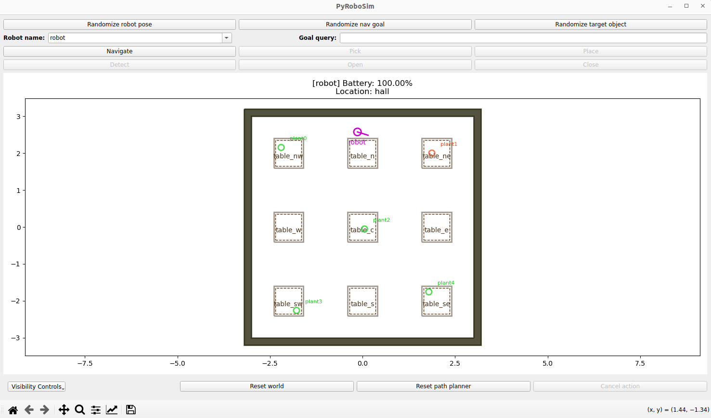
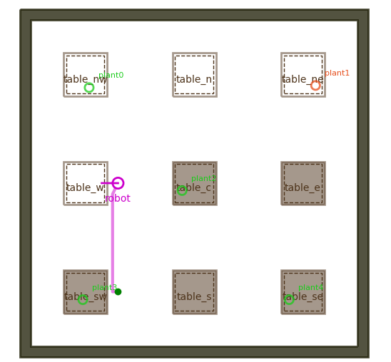
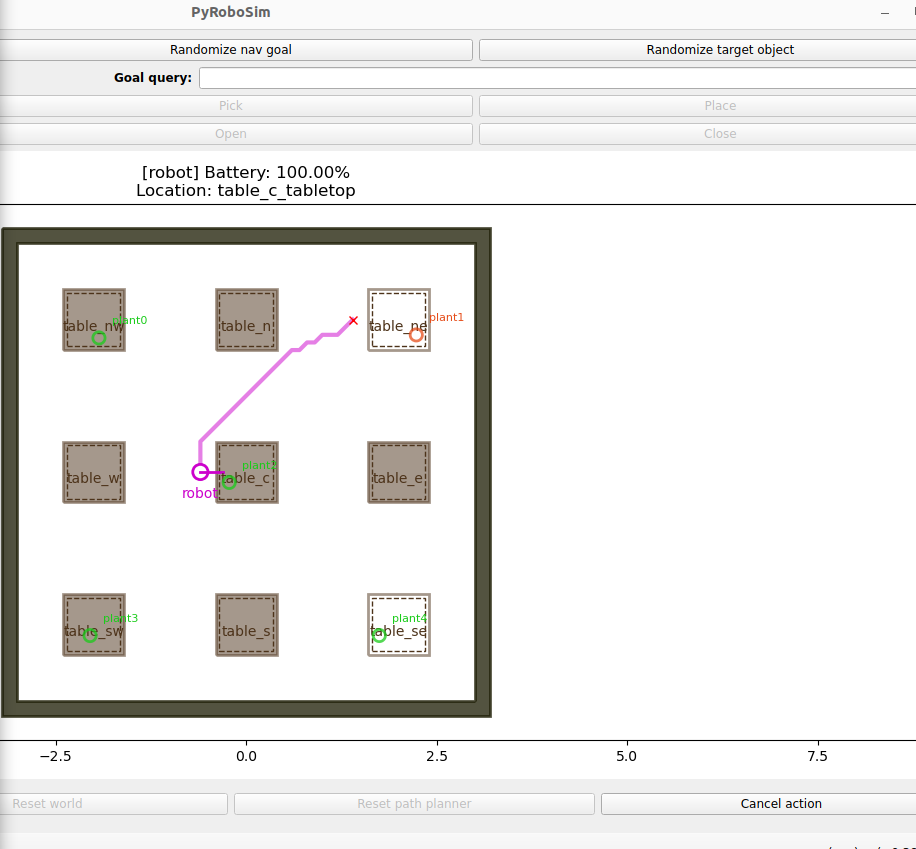
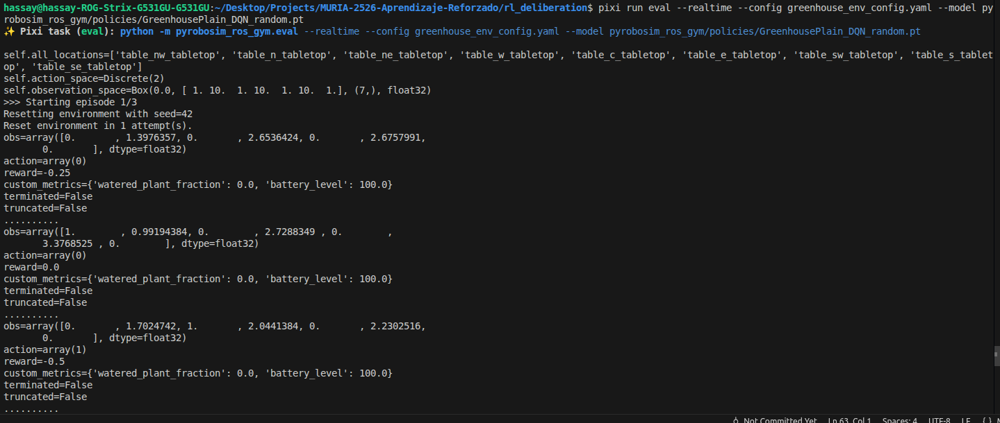
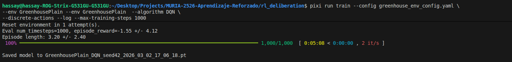
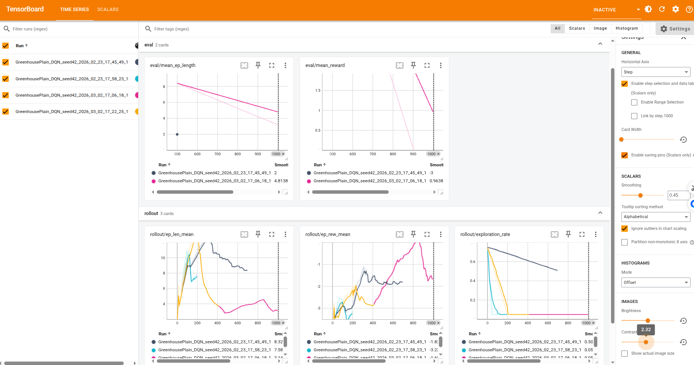

# MURIA-2526-Aprendizaje-Reforzado
Aprendizaje reforzado - Asignatura del máster en IA y robótica de la ULE

Primero, set pixi env:


```bash
export PATH="$HOME/.pixi/bin:$PATH"
pixi --version
```
El workshop cuenta con varios mundos que se pueden levantar (BananaPick, BananaPlace, BananaPlaceNoSoda, GreenhousePlain, GreenhouseBattery, GreenhouseRandom), en este caso se seleccionará "GreenhousePlain".

Desde el directorio rl_deliberation lanzamos el mundo:

```bash
pixi run start_world \
--env GreenhousePlain
```




### Ejercicio 1: Agente manual

En otra terminal lanzamos el agente en modo manual
```bash
pixi run eval --model manual \
--env GreenhousePlain \
--config \
greenhouse_env_config.yaml
```

En este modo el usuario es el agente que decide si regar (1) o no regar (0) la planta en la que se encuentra el robot via input de teclado.
Según se van haciendo elecciones, se obtiene un reward y se modifica el estado del mundo. En el caso de que el usuario haya regado la mesa en la que se encuentra, esta pasará a estar en un estado gris oscuro y ya no se navegará a ella en siguientes iteraciones.
 
 

 
Cuando todas las plantas han sido regadas correctamente, el agente riega una planta "malvada" o se supera un número máximo de iteraciones la simulación llega a su fin y comienza un nuevo episodio.

### Ejercicio 2: Agente aleatorio

En otra terminal lanzamos el agente en modo aleatorio:

```bash
pixi run eval --realtime \
--config greenhouse_env_config.yaml --model \
pyrobosim_ros_gym/policies/GreenhousePlain_DQN_random.pt
```

En este caso se escoge una política DQN que escoge valores aleatorios (GreenhousePlain_DQN_random.pt)



En cada paso se provee feedback del estado de la simulación y de cómo impactan las decisiones tomadas por el agente (ej: obtención de recompensas).
Este feedback aparece en la terminal donde se ha lanzado el agente que sigue la política determinada.




### Ejercicio 3: Entrenamiento de un agente:

Es importante levantar la simulación sin interfaz gráfica (headless) para reducir al máximo el tiempo de entrenamiento del agente.

```bash
pixi run start_world --env GreenhousePlain --headless
```

En otra terminal iniciamos el entrenamiento.
```bash
pixi run train --config greenhouse_env_config.yaml \
--env GreenhousePlain --algorithm DQN \
--discrete-actions --realtime
```

El agente puede ser entrenado utilizando distintos algoritmos, como DQN, PPO, SAC o A2C.
Dependiendo del algoritmo elegido el entrenamiento variará.

*DQN:*
- Tipo: Off-policy Q‑learning, pensado para acciones discretas.
- Mecanismo: usa replay buffer + target network; actualizaciones por lotes desde el buffer.
- Ventajas: relativamente simple; buena muestra‑eficiencia en entornos discretos.
- Contras: no nativamente para acciones continuas; sensibilidad a eps‑greedy/exploration y tamaño de buffer.
- Parámetros importantes: learning_starts, train_freq, gradient_steps, target_update_interval, batch_size, exploration_*.
- Dónde cambiarlo: sección DQN en pyrobosim_ros_gym/config/greenhouse_env_config.yaml.


*PPO:*
- Tipo: On‑policy, actor‑critic con clipping (proximal policy optimization).
- Mecanismo: recoge rollouts on‑policy (n_steps), luego realiza varias épocas de optimización sobre esos datos (batch/epoch).
- Ventajas: estabilidad y robustez; sirve para discretos y continuos.
- Contras: menos muestra‑eficiente que off‑policy (requiere más interacciones).
- Parámetros importantes: n_steps, batch_size, learning_rate, clip_range, n_epochs (en SB3 se pasa en policy_kwargs/config).
- Dónde cambiarlo: sección PPO en pyrobosim_ros_gym/config/greenhouse_env_config.yaml.

*SAC:*
- Tipo: Off‑policy, actor‑critic con entropía máxima (Soft Actor‑Critic).
- Mecanismo: replay buffer + políticas estocásticas; optimiza suma de recompensa + entropía.
- Ventajas: alta muestra‑eficiencia en acciones continuas; estabilidad y exploración automática (entropy tuning).
- Contras: mayor coste computacional por paso (varias redes, tuning de entropía).
- Parámetros importantes: gradient_steps, train_freq, tau, learning_rate, batch_size.
- Dónde cambiarlo: sección SAC en pyrobosim_ros_gym/config/greenhouse_env_config.yaml.

*A2C (A sincronous advantage actor‑critic):*
- Tipo: On‑policy, actor‑critic (síncrono).
- Mecanismo: actualizaciones periódicas tras n_steps usando ventajas; suele correr con múltiples entornos en paralelo para estabilidad.
- Ventajas: bajo overhead de memoria (no replay buffer); simple y rápido en paralelización.
- Contras: menos estable/robusto que PPO en algunos casos; muestra‑eficiencia media.
- Parámetros importantes: n_steps, learning_rate, gamma, policy_kwargs.
- Dónde cambiarlo: sección A2C en pyrobosim_ros_gym/config/greenhouse_env_config.yaml.

Para amenizar el proceso, se ha añadido un nuevo argumento --max-training-steps para reducir el número de iteraciones a la hora de entrenar agentes y crear nuevas políticas.
El argumento --log nos dota de la capacidad de ver cómo evoluciona el entrenamiento utilizando tensorboard (pixi run tensorboard)

```bash
pixi run train --config greenhouse_env_config.yaml \
--env GreenhousePlain --env GreenhousePlain  --algorithm DQN \
--discrete-actions --log --max-training-steps 1000
```

Una vez entrenado se guarda el modelo 


Desde tensorboard (una vez lanzado corre en *http://localhost:6006/*) podemos obtener gráficas de distintas estadísticas (avg time por episodio, media de recompensas, etc) que nos aportan información relevante a nivel comparativo.



### Ejercicio 4: Entrenamiento en entornos más complejos


