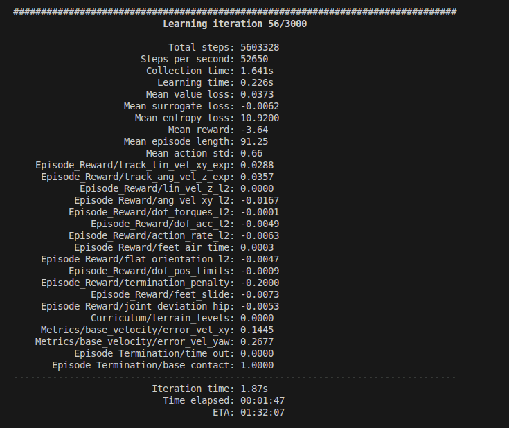
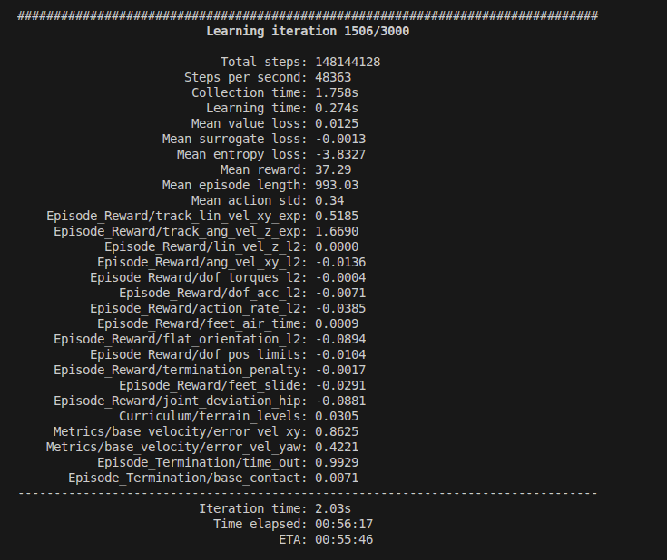
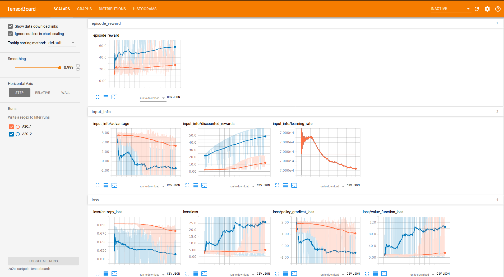
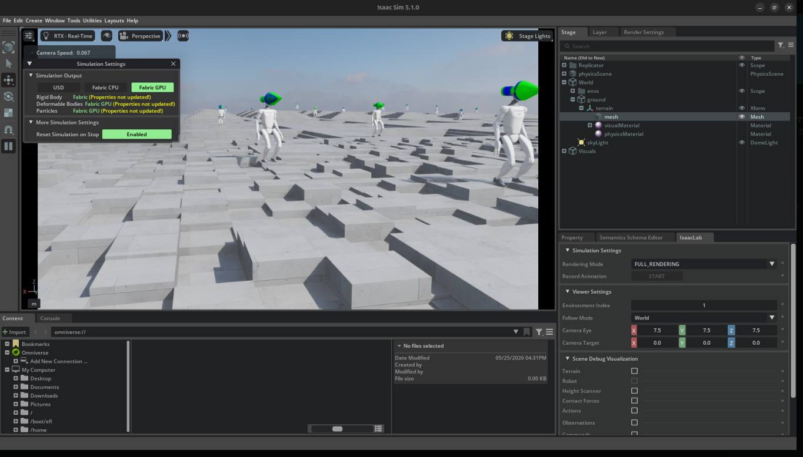
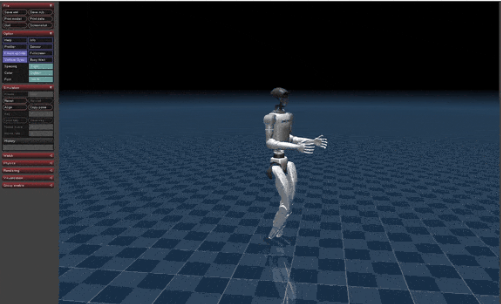

# LeggedGym

Se establece el siguiente flujo:

- Se define un entorno vectorizado (con muchos robots en paralelo en GPU para aumentar la velocidad de entrenamiento).
- Entrenar una policy con **PPO** (utilizando *rsl_rl*).
- Cargar la policy para “play” (evaluación).

La idea clave de LeggedGym son las “task” que se están compuestas por:

- Una **clase de entorno** (hereda de LeggedRobot).
- Una configuración del entorno (parámetros del mundo, robot, observaciones, recompensas…).
- Una configuración del entrenamiento (arquitectura de red + PPO + logging/checkpoints…).

Esto se modela en forma de "tasks".
Una task es la definición completa del problema de RL que se busca resolver.
Se especifica el entorno (dinámica, reset, terminaciones), las observaciones y el espacio de acciones del agente.
Y se definen las recompensas/costes que guíab el aprendizaje hacia el comportamiento deseado.

## Registro de tasks (*--task g1*)

En *legged_gym/envs/__init__.py* se importan las clases/configs de distintos robots.
El que utilizaremos para esta práctica será el del robot g1.

En este workspace, los ficheros *g1_env.py* y *g1_config.py* son precisamente los que conforman esa task.

---

## 1) Configuración (g1_config.py)

**g1_config.py** define **qué se entrena** (estado, recompensas...) y **con qué red/algoritmo** (LeggedRobotCfgPPO.algorithm).

### *G1RoughCfg*

- *control*: ganancias PD + *action_scale* y *decimation*.
- *domain_rand*: fricción, masa base, empujes, etc.
- *rewards.scales*: pesos de cada término de recompensa.

### *G1RoughCfgPPO*

- Define la policy (dimensiones, activación) y que es recurrente (*ActorCriticRecurrent* con LSTM).
- Define parámetros PPO (*entropy_coef*).
- Define *runner.experiment_name* y *runner.max_iterations* (controlan logging y duración del entrenamiento).


## 2) Entorno (g1_env.py)

**g1_env.py** implementa la parte “dinámica” del problema: qué observa el robot, cómo se calcula la recompensa y qué buffers extra se actualizan.

### compute_observations (Observaciones)

Las obsercaciones son el vector numérico que el entorno le entrega a la policy en cada "step" de simulación para que ésta decida la acción.

Construye obs_buf concatenando (en este orden):

- *base_ang_vel* (3)
- *projected_gravity* (3)
- *commands[:3]* (3)
- *dof_pos - default_dof_pos* (12)
- *dof_vel* (12)
- *actions* (12)
- *sin_phase*, *cos_phase* (1 + 1)

Total: $3+3+3+12+12+12+1+1=47$ (que coincide con *G1RoughCfg.env.num_observations* de g1_config.py)
En el contexto de esta práctica es posible que haya que reducir el número de articulaciones/grados de libertad, ya que parece que no coinciden las del repositorio de RL de Jean con las de Isaacgym.
Además, *privileged_obs_buf* añade *base_lin_vel* (3) al principio, dando 50 (que coincide a su vez con *num_privileged_obs* de g1_config.py).

Si *cfg.noise.add_noise* está activo, se aplica ruido escalado por *_get_noise_scale_vec*.
Este "noise" es ruido artificail que se añade a las observaciones durante el entrenamoento para que la policy sea más robusta ante errores de los sensores o del modelado al hacer el paso de simulador al mundo real.

### Recompensas (**reward**)

En LeggedGym, los términos de recompensa suelen mapearse por nombre:

- En el config se define *rewards.scales.<nombre> = ...*.
- En el env existe un método *_reward_<nombre>()*.

Luego la recompensa total se construye como suma ponderada de esos términos.

En este G1 aparecen, entre otros:

- *_reward_alive* (mantenerse “vivo”) - Positiva
- *_reward_contact*, *_reward_feet_swing_height*, *_reward_contact_no_vel*.
- *_reward_hip_pos* (penalización por cierta postura).


## 3) Entrenamiento (train.py)

*train.py* sigue el patrón de LeggedGym:

1. *env, env_cfg = task_registry.make_env(name=args.task, args=args)*
2. *ppo_runner, train_cfg = task_registry.make_alg_runner(env=env, name=args.task, args=args)*
3. *ppo_runner.learn(num_learning_iterations=train_cfg.runner.max_iterations, ...)*

Qué hace internamente *task_registry* (resumen del repo de referencia):

- Valida que el *name* esté registrado.
- Toma *env_cfg/train_cfg* del registro y los puede **sobreescribir** con flags de CLI.
- Construye *sim_params* y crea el entorno (*task_class(cfg=env_cfg, sim_params=...)*).
- Crea un *OnPolicyRunner* (PPO) y prepara el directorio de logs.
- Si *train_cfg.runner.resume = True*, busca un checkpoint y lo carga.

```bash
python train.py --task g1
```

Al lanzar el entrenamiento de esta task se va obteniendo el feedback que se ve en esta imagen:


Cabe destacar que se registra la información de cada episodio , así como la recompensa promedio de todas las instancias que con cada iteración va aumentando, y la pérdida de la entropía disminuyendo.
EN caso de que los valores de las pérdidas o las rewards se muestren erráticas entre iteraciones, esto sería un indicador de que las rewards están mal escaladas o mal asignadas, o bien de que el learning rate es demasiado elevado.

En el caso de la entropy: a más elevado el valor de esta, más se explora, si es menor, se buscara explotar lo ya aprendido.


Como se puede apreciar en esta segunda captura, a medida de que las iteraciones tienen lugar, la entropía disminuye y la recompensa promedio aumenta. En el caso de que haya pasado una cantidad de iteraciones grande y no notemos cambios en estas dos variables clave, hay algo que está mal con nuestra política y que deberíamos revisar.
A su vez, sería interesante establecer una política de parada (early stopping) si durante los últimos X episodios la recompensa promedio parece estancada o establecer un umbral (threshold) desde un inicio y que se detenga el entrenamiento al llegar a ese punto.

[!NOTE]
A la hora de entrenar, es importante utilizar el argumento --headless para reducir la carga computacional de la ejecución. E incluso reducir el número de environments en el archivo de configuración del robot para levantar menos instancias simultáneas del robot.


## 4) Evaluación / ejecución (play.py)

*play.py* carga una policy entrenada y ejecuta el bucle *obs >> policy >> actions >> env.step(actions)*.

En este script se fuerzan ajustes de evaluación:

- Limita *num_envs* (p.ej. máximo 100).
- Desactiva curriculum/ruido/domain randomization.
- Marca *env_cfg.env.test = True*.
- Activa *train_cfg.runner.resume = True* para cargar el último checkpoint.

Ejemplo:

```bash
python play.py --task g1
```

## 5) Logs de entrenamiento (TensorBoard)

Es posible echar un vistazo a fondo a los logs utilizando **TensorBoard**. En lugar de depender únicamente de los prints en consola, las librerías de RL (como `rsl_rl`) guardan de forma automática eventos y métricas de entrenamiento. 

**¿De dónde se obtienen los datos?**
Los eventos de TensorBoard se escriben en el directorio de salida del proyecto (normalmente dentro de la carpeta `logs/<nombre_del_experimento>/` o `runs/`). Cada ejecución crea allí un fichero especial (*events.out.tfevents...*) que TensorBoard puede leer.

**Comando para lanzar TensorBoard:**
Abriendo una terminal en la raíz de tu proyecto o directorio de logs, ejecuta:
```bash
tensorboard --logdir logs/
```
*(Esto dejará los logs visibles en el puerto 6006 -> `http://localhost:6006`)*



Estos logs presentan distintas métricas:

- **`Episodic_Reward` (Recompensa por Episodio)**: Es la métrica más importante. Indica la recompensa total que el robot acumula durante un episodio completo; debe tener una clara tendencia **ascendente** a lo largo del tiempo, indicando que el agente está aprendiendo.
- **`Loss / Policy_loss` (Pérdida del Actor)**: Refleja cuánto está ajustando el modelo de su política para maximizar las ventajas. Sus valores suelen fluctuar, pero picos muy erráticos pueden indicar que el "learning rate" es muy alto.
- **`Loss / Value_loss` (Pérdida del Crítico)**: Refleja el error del modelo al predecir cuánta recompensa futura obtendrá desde un estado dado. Idealmente debe reducirse con el tiempo indicando que el crítico "adivina" mejor.
- **`Entropy` (Entropía)**: Métrica que mide el grado de aleatoriedad (exploración) de las acciones generadas. Empezará en valores elevados (explora mucho) y debería **disminuir paulatinamente** hasta estabilizarse cuando el robot aprende qué acciones son buenas y las "explota".
- **`Reward / <termino_concreto>`**: Si se configuran los logs de recompensas por separado, aquí podrás ver cómo evolucionan términos concretos entre iteraciones (por ejemplo, ver si la penalización por `torso_orientation` cae a 0 o si el reward de `elbow_height` sube a su valor máximo).
- **`FPS` (Frames per Second)**: Indica cuántos pasos de simulación procesa el sistema por segundo. Depende mucho de si se entrenó con `--headless` y la potencia de tu GPU.

## 6) Lanzamiento en IsaacSim

Con el script presente en el repositorio (isaaclab.sh) sería posible lanzar el simulador con la policy entrenada para un número de robots (envs) configurable. En el caso de este ejemplo se lanzaría con 50 instancias.

./isaaclab.sh -p scripts/reinforcement_learning/rsl_rl/play.py --task Isaac-Velocity-Rough-G1-v0 --load_run 2026-05-18_19-41-41 --num_envs 50




## 7) Es puede exportar a TorchScript (JIT)

En *play.py*, si *EXPORT_POLICY = True*, se exporta la policy a TorchScript (útil para ejecutar en entornos como Mujoco).

En el flujo de referencia, el destino donde se guarda suele ser:

```bash
<LEGGED_GYM_ROOT_DIR>/logs/<experiment_name>/exported/policies/
```

## 8) Usar la policy en Mujoco

Una vez exportada la policy con TorchScript (JIT), el paso final es cargarla y ejecutarla en el motor físico de MuJoCo. La transición del entrenamiento en Isaac Gym/Lab a la ejecución en MuJoCo se denomina sim2sim (Simulator to Simulator).

### ¿Qué contiene exactamente esta policy exportada?

La policy exportada es un modelo computacional estático de PyTorch (`.pt`). Para garantizar la simetría y compatibilidad con el motor de MuJoCo, el modelo se guía por este contrato estricto de entrada/salida:

1. **Entradas (Observaciones)**: La política espera un tensor que sea estructuralmente **idéntico** al construido durante el entrenamiento en `compute_observations`. Debes replicar desde cero en MuJoCo la recolección de los datos de sensores y aplicarles los **mismos factores de escalado** (`cfg.normalization.obs_scales`). Por lo general recibe: velocidades angulares, gravedad proyectada al cuerpo del robot, `dof_pos` relativas a su valor default, `dof_vel` y las acciones calculadas en el frame anterior.
2. **Salidas (Acciones)**: La red devuelve un tensor (típicamente normalizado alrededor de $[-1, 1]$). Es importante notar que **no devuelve torques**. Estas señales deben multiplicarse por el `action_scale` (definido en el training) y sumársele a la postura predeterminada `default_dof_pos`.
3. **Control PID en MuJoCo**: Estos valores de acción objetivo se asignan a la propiedad de control `data.ctrl` de MuJoCo. Para que funcione adecuadamente, el modelo `.xml` (MJCF) que carga MuJoCo debe establecer sus actuadores en modo **posición** y utilizar las mismas rigideces ($K_p$) y amortiguaciones ($K_v$) que tenía el modelo de Isaac.



### Ejemplo de flujo (snippet sim2sim)

```python
import torch
import mujoco

# 1. Cargar la política exportada desde la carpeta logs
policy = torch.jit.load("logs/g1_tray/exported/policy_1.pt")
policy.eval() # Fijar en modo inferencia pura

while True:
    # 2. Reconstruir observación (misma lógica que en g1_env.py)
    obs = compute_mujoco_observations(data, default_dof_pos)
    
    # 3. Pasar por el modelo de ML (Cálculo forward) sin autograd
    with torch.no_grad():
        actions = policy(torch.tensor(obs, dtype=torch.float32))
    
    # 4. Escalar las acciones para generar los objetivos físicos reales
    scaled_actions = actions.numpy() * action_scale 
    
    # 5. Enviar comandos a los controladores PD de MuJoCo
    data.ctrl[:] = default_dof_pos + scaled_actions
    
    # 6. Avanzar el paso de la física
    mujoco.mj_step(model, data)
```

## 7) Cómo crear una nueva task de G1 (variantes)

Para entrenar “variantes” sin tocar la base:

1. Duplica/deriva *G1RoughCfg* y/o *G1RoughCfgPPO* (ej: *G1FlatCfg*, *G1RoughNoPushCfg*).
2. Si cambias observaciones, actualiza coherentemente:
   - *cfg.env.num_observations*
   - *cfg.env.num_privileged_obs*
   - el orden/longitud en *compute_observations*
   - *_get_noise_scale_vec* (debe coincidir con el layout de *obs_buf*)
3. Asigna un nuevo nombre en *task_registry.register("g1_flat", G1Robot, G1FlatCfg(), G1FlatCfgPPO())*.
4. Entrena con *--task g1_flat*.

---

# Entrenar una política para que el robot porte una bandeja
## Planteamiento del problema
La idea es entrenar una política, utilizando como base inicial la del robot capaz de caminar. Se ha de modificar esta política para incluir refuerzo positivo/negativo según el ángulo de las articulaciones/grados de libertad asociados a los brazos. La idea es establecer un reward positivo en caso de que el codo esté situado a la altura del pecho y las muñecas extendidas, de manera que el robot fuese capaz de portar la bandeja. Se seguirá recompensando el hecho de que mantenga dicha posición y se penalizará el hecho de que el robot mueva los brazos de esta posición.

También sería ideal establecer en la política un reward positivo por mantener el torso perpendicular al suelo, de manera que no intente hacer movimientos bruscos de inclinación, evite volcar la supuesta bandeja y se mantenga en una postura estable, recta y natural.

## Solución y modificaciones

### Configuración del env (`g1_tray_env_config.py`)

Este archivo define **qué recompensas recibe el robot** durante el entrenamiento. Es la clave para enseñarle la postura correcta de portar bandeja.

**Aspectos principales:**

```python
class TrayRewardsCfg:
    # Mantener altura de codos (bandeja a la altura del pecho)
    elbow_height = RewTerm(
        func=tray_rew.elbow_height_reward,
        weight=0.4,
        params={
            "target_height": 1.10,  # Altura objetivo: ~1.1m
            "sigma": 0.03,           # Tolerancia: ±3cm
        },
    )
    
    # Extender muñecas (brazos rectos)
    wrist_extension = RewTerm(
        func=tray_rew.wrist_extension_reward,
        weight=0.25,
        params={
            "target_left_wrist": 0.3,   # Ángulo objetivo
            "target_right_wrist": 0.3,
            "sigma": 0.05,
        },
    )
    
    # Antebrazos paralelos al suelo
    forearm_horizontal = RewTerm(
        func=tray_rew.forearm_horizontal_reward,
        weight=0.35,
        params={
            "sigma": 0.04,
        },
    )
    
    # Simetría entre brazos izquierdo y derecho
    arm_symmetry = RewTerm(
        func=tray_rew.arm_symmetry_reward,
        weight=0.15,
        params={
            "sigma": 0.03,
        },
    )
    
    # Torso perpendicular al suelo (espalda recta)
    torso_orientation = RewTerm(
        func=tray_rew.torso_orientation_reward,
        weight=0.20,
        params={
            "sigma": 0.05,
        },
    )
```

**Cómo funciona:**
- Cada `RewTerm` define un término de recompensa
- EL `weight` indica qué tan importante es ese término (cuanto mayor = más influencia)
- El robot recibe recompensa positiva cuando cumple los criterios
- La suma de todos los términos forma la recompensa total del episodio

---

### Configuración de las observaciones (`g1_observations.py`)

Las observaciones son la **información que el robot "ve"** en cada step. Define qué datos se pasan a la política para que tome decisiones sobre cómo mover los brazos.

**Funciones principales:**

```python
def arm_joint_positions(robot):
    """Posiciones actuales de las articulaciones de los brazos"""
    return torch.stack([
        joint_pos[:, robot.left_shoulder_pitch_joint_id],   # Hombro izq
        joint_pos[:, robot.left_elbow_joint_id],            # Codo izq
        joint_pos[:, robot.left_wrist_pitch_joint_id],      # Muñeca izq
        joint_pos[:, robot.right_shoulder_pitch_joint_id],  # Hombro der
        joint_pos[:, robot.right_elbow_joint_id],           # Codo der
        joint_pos[:, robot.right_wrist_pitch_joint_id],     # Muñeca der
    ], dim=-1)


def arm_joint_velocities(robot):
    """Velocidad actual de las articulaciones de los brazos"""
    # Similar a arm_joint_positions, pero con velocidades
    return torch.stack([...], dim=-1)


def elbow_heights(robot):
    """Altura Z de ambos codos en el espacio mundial"""
    left_elbow = robot.data.body_pos_w[:, robot.left_elbow_body_id]
    right_elbow = robot.data.body_pos_w[:, robot.right_elbow_body_id]
    return torch.stack([
        left_elbow[:, 2],  # Coordenada Z (altura)
        right_elbow[:, 2],
    ], dim=-1)
```

**Por qué son importantes:**
- La política usa estas observaciones para saber "dónde están los brazos"
- Permite retroalimentación: si el codo está bajo, la política puede levantarlo
- Al incluir velocidades, evita movimientos bruscos o inestables

---

### Implementación de las recompensas (`rewards.py`)

Este archivo implementa las **funciones matemáticas que calculan cuánta recompensa recibe el robot** en cada frame.

**Ejemplo conceptual de cómo funciona una recompensa:**

```python
def elbow_height_reward(robot, target_height=1.10, sigma=0.03):
    """
    Recompensa que premia mantener codos a altura del pecho
    
    Fórmula (Gaussian):
    - Si altura_codo ≈ target_height >> recompensa ≈ 1.0 (máxima)
    - Si altura_codo está muy diferente >> recompensa ≈ 0.0 (nula)
    - El parámetro sigma controla qué tan estricto es el criterio
    """
    elbow_heights = get_elbow_heights(robot)  # Obtener alturas actuales
    
    # Calculamos la diferencia con  el objetivo
    error = torch.abs(elbow_heights - target_height)
    
    # Recompensa Gaussiana (campana de Gauss)
    reward = torch.exp(-(error ** 2) / (2 * sigma ** 2))
    
    return reward


def arm_symmetry_reward(robot, sigma=0.03):
    """
    Recompensa que premia que ambos brazos hagan lo mismo (simetría)
    
    - Si brazos_izq ≈ brazos_der >> recompensa = 1.0
    - Si brazos son distintos >> recompensa baja
    """
    left_pos = robot.data.joint_pos[:, left_arm_joints]
    right_pos = robot.data.joint_pos[:, right_arm_joints]
    
    error = torch.abs(left_pos - right_pos)
    reward = torch.exp(-(error ** 2) / (2 * sigma ** 2))
    
    return reward


def torso_orientation_reward(robot, sigma=0.05):
    """
    Recompensa que premia mantener el torso recto.
    
    Penaliza la inclinación de la base respecto al eje de gravedad.
    Se analiza la gravedad proyectada en los ejes X e Y del robot.
    Si el robot está perfectamente recto, estos componentes son ~0.
    """
    # Magnitud de la desviación del torso en los ejes horizontal y lateral
    error = torch.sum(torch.square(robot.data.projected_gravity_b[:, :2]), dim=1)
    
    return torch.exp(-error / (2 * sigma ** 2))
```


---

# BeyondMimic (Documentación extra que no ha sido utilizada)

BeyondMimic es un “stack” distinto a LeggedGym, pero su flujo es bastante similar:

- En LeggedGym se selecciona una task con *--task g1* que existe porque se registró en *task_registry*.
- En BeyondMimic (whole-body tracking) se seleccionan las tasks de la misma manera, y se encuentran registradas en **Gymnasium** (*gym.register*).

En el repositorio, este *gym.register(...)* para G1 está en:

- `BeyondMimic/whole_body_tracking/source/whole_body_tracking/whole_body_tracking/tasks/tracking/config/g1/__init__.py`

La diferencia principal es que BeyondMimic está montado sobre **Isaac Lab** (Manager-based API) y usa **Hydra** para cargar las configs y **WandB Registry** para gestionar las motions.

---

## 1) Motion Tracking (whole body tracking)

La idea es entrenar una policy que, en cada step, intenta que el robot replique (“trackee”) una **trayectoria de referencia** (motion) de cuerpo completo.

En vez de optimizar solo “caminar hacia una velocidad objetivo”, aquí se busca optimizar “parecerte a esta demostración” (posiciones/orientaciones/velocidades de varias partes del cuerpo).


## 2) Registro de tasks

En *whole_body_tracking*, el registro se hace con *gym.register(...)* y el id de task queda como string.

Ejemplos:

- *Tracking-Flat-G1-v0*
- *Tracking-Flat-G1-Wo-State-Estimation-v0*
- *Tracking-Flat-G1-Low-Freq-v0*

Cada *gym.register* apunta a:

- *entry_point = isaaclab.envs:ManagerBasedRLEnv*
- *env_cfg_entry_point = ...G1FlatEnvCfg* - similar a G1RoughCfg de LeggedGym
- *rsl_rl_cfg_entry_point = ...G1FlatPPORunnerCfg* - similar a G1RoughCfgPPO - similar a G1RoughCfg de LeggedGym


## 3) Datos: motion de referencia (CSV >> NPZ >> WandB)

Un **motion** es un “clip” o **trayectoria de referencia en el tiempo** que describe cómo debería moverse el robot: es decir, una secuencia de *poses* (joints y/o poses de cuerpos) y, a veces, también velocidades/aceleraciones. La policy no intenta “ir a un target de velocidad”, sino **minimizar el error** entre su estado actual y el estado objetivo que marca ese motion en cada instante.

En BeyondMimic el motion de referencia se prepara antes de entrenar:

1. Partes de un motion retargeted (típicamente *.csv*).
2. Se convierten a *.npz* con forward-kinematics (para incluir no solo joints, también pose/vel/acc de cuerpos).
3. Se sube a WandB Registry para poder cargarlo por nombre desde los scripts de entrenamiento.

---